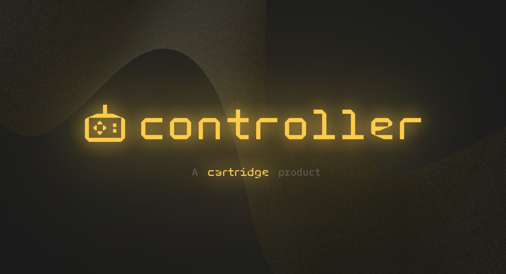

# Controller

Controller is a gaming specific smart contract wallet that enables seamless player onboarding and game interactions.

It supports transaction signing using Passkeys and Session Tokens.

## Project structure
The project consists of several subfolders located in the ```packages``` directory:

- **[account_sdk](packages/account_sdk)** - a rust sdk for interacting interacting with the controller account contract.
- **[account-wasm](packages/account_wasm)** - a wasm version of the rust account sdk for usage in the browser.
- **[contracts](packages/contracts)** - a cairo project containing the controller account contract, signer, and session implementations.
- **[keychain](packages/keychain)** - a sandboxed application hosted at https://x.cartridge.gg/ and responsible for sensitive operations, such as signing transactions. When an application requests to sign or execute a transaction, keychain enforces client side authorization logic and displays UI for user approval if necessary.
- **[controller](packages/controller)** sdk. Controller implements the account interfaces required by [starknet.js](https://github.com/0xs34n/starknet.js). Underneath, the implementation communicates with an embedded sandboxed keychain iframe.

## Development

### Frontend

Install pnpm via corepack:

```sh
corepack enable pnpm
```

Install dependencies:

```sh
pnpm i
```

Build dependencies:

```sh
pnpm build
```

Run `keychain` and `starknet-react-next`:

```sh
pnpm dev
```

Open <http://localhost:3002> in your browser.

The simplest way to then develop with your cartridge account is to port it over
from the production keychain:

- Login to your account at https://x.cartridge.gg/login
- Open your console, dump your account with `window.cartridge.exportAccount()`
  and copy it
- Visting your local keychain at http://localhost:3001/
- Load your account into your local keychain

```js
window.cartridge.importAccount("EXPORTED ACCOUNT");
```

### Contracts

#### Compiling the cairo code

To build rust you first have to compile cairo. Run

```bash
make
```

in the root directory.

#### Commiting changes 

The compiled account is stored in the git repository in the `crates/account_sdk/compiled/` folder. To make sure that the tests are run against the most reacent version of the code run `make` in the root repository. The `make` command should also be run before commiting any changes to ensure a valid state of the compiled code. 

#### Running the tests

Note, that to run the tests you first have to [compile](#compiling-the-cairo-code) (to sierra and casm) the contract in the `controller` folder.

Starknet Foundry tests:

```bash
snforge test -p controller
```

Scarb tests:

```bash
scarb test -p webauthn_*
```

After the contract is compiled run the tests using `cargo`:

```bash
cargo test
```

The scarb builds the contract and saves the compiled code in the `controller/target` folder. The tests then fetch (at compile time) the comipled code and deploy it to the local network. Note that obviously the contract needs to be recompiled for any changes to be applied in the compiled code.
