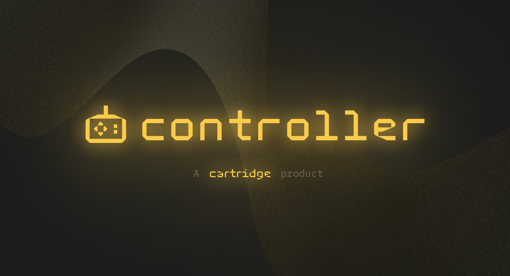

# Controller

Controller is a gaming specific smart contract wallet that enables seamless
player onboarding and game interactions.

It supports transaction signing using Passkeys and Session Tokens.

## Project structure

The project consists of several packages in the `packages` directory:

- **[keychain](packages/keychain)** - Sandboxed iframe hosted at
  https://x.cartridge.gg/ that fills the same role as an injected wallet like
  MetaMask or Rabby: holds keys, signs transactions, and prompts user for
  approval. Also displays account state (balances, activities, achievements).
- **[controller](packages/controller)** - Main SDK implementing the account
  interfaces required by [starknet.js](https://github.com/0xs34n/starknet.js).
  Ships two provider modes:
  - **ControllerProvider** (web apps) - Full-featured web wallet communicating
    with an embedded keychain iframe. Supports sessions as well as
    per-transaction approval.
  - **SessionProvider** (native apps) - Creates ephemeral session keys with
    pre-configured policies so transactions can execute without per-call
    approval.
- **[connector](packages/connector)** - Registers configured providers through
  wallet-standard discovery, making them available to Starknet Start's
  `<StarknetConfig>`.

Integration examples live in `examples/` (Next.js, Svelte, Node.js).

## Requirements and Starknet.js v10 migration

Controller requires Node.js 22 or newer and uses Starknet.js `10.0.2`.
Applications upgrading from Controller 0.13.x should align their Starknet.js
dependency to `10.0.2`. Starknet.js v10 no longer exposes provider methods
through account instances, so application code should use
`account.provider.getChainId()`, `account.provider.callContract()`, and
`account.provider.waitForTransaction()`.

The previous `@starknet-react/core` and `@starknet-react/chains` integration has
moved to `@starknet-start/react@1.0.8`, with `@starknet-start/chains@1.0.7`,
`@starknet-start/providers@1.0.7`, and `@starknet-start/explorers@1.0.7`.
Starknet Start requires React 19.

The workspace temporarily overrides transitive Starknet.js versions to `10.0.2`
because `@starknet-start/providers@1.0.7` and `@starknet-start/query@1.0.7`
resolve Starknet.js v9. The override collapses application bundles to the exact
v10 version and can be removed once those packages depend on Starknet.js v10.

## Custom Torii endpoint

Set `toriiUrl` when a game uses a Torii indexer that is not derived from its
Slot project name:

```ts
import Controller from "@cartridge/controller";

const controller = new Controller({
  slot: "my-game-mainnet",
  toriiUrl: "https://torii.example.com",
});
```

An explicit `toriiUrl` takes precedence over `slot`. When `toriiUrl` is omitted,
Controller retains the legacy Slot-derived endpoint at
`https://api.cartridge.gg/x/<slot>/torii`.

## Controller client notifications

The controller emits toast notifications for wallet activity (transactions,
network changes, achievements, etc.). To display them, mount
`<ControllerToaster />` once in your app and import its stylesheet — it is
self-contained, with no extra dependencies to install:

```tsx
import { ControllerToaster } from "@cartridge/controller/react";
import "@cartridge/controller/react/styles.css";

function App() {
  return (
    <>
      {/* your app */}
      <ControllerToaster />
    </>
  );
}
```

Toast types emitted: `error`, `success`, `network`, `transaction`,
`marketplace`, `achievement`, `user`, `setting`, `credits`.

Optional props:

- `position` — screen placement (default: `bottom-right`)
- `duration` — display time in ms (default: `5000`)
- `disabledTypes` — toast types to suppress
- `collapseTransactions` — minimal transaction toasts (icon only)

## Development

### Frontend

Install pnpm via corepack:

```sh
corepack enable pnpm
```

Install dependencies:

```sh
pnpm i
```

Run Controller with examples:

```sh
pnpm dev
```

This command builds all workspace dependencies first and start these servers:

- http://localhost:3002: Controller Example (Next.js)
- http://localhost:5174: Controller Example (Svelte)
- http://localhost:3001: Keychain
- http://localhost:3003: Profile

The simplest way to then develop with your cartridge account is to port it over
from the production keychain:

- Login to your account at https://x.cartridge.gg/login
- Open your console, dump your account with `window.cartridge.exportAccount()`
  and copy it
- Visting your local keychain at http://localhost:3001/
- Load your account into your local keychain

```js
window.cartridge.importAccount("EXPORTED ACCOUNT");
```
