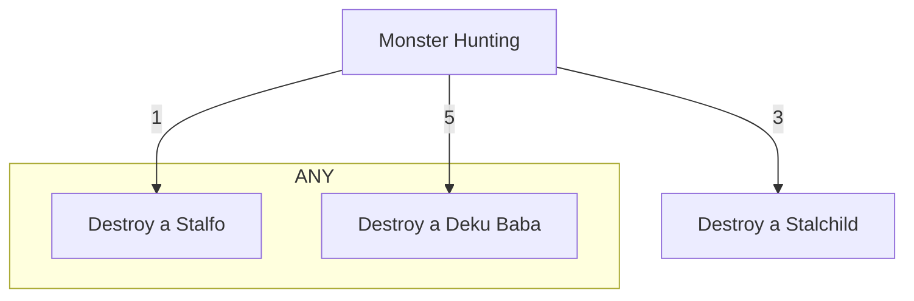

# Cartridge Quests

## Implementation

A quest is defined when the `quest_progress` event is emitted with a unique ID field and a [metadata URI](#metadata-uri). Its status is updated via events that are emitted as a result of a player's in-game actions.

Quests can have a one-to-many relationship to other quests. Child quests need to be completed by the player first before the parent can be completed. A quest's completion criteria is defined in the [metadata](#metadata-uri).

### Interface

#### Contract

```cairo
@event
func quest_progress(
  id: felt,
  player: felt,
  metadataURI_len: felt,
  metadataURI: felt*
) {
}
```

#### Metadata URI

The value of `metadataURI` should be a data URI (`data:application/json,...`) or an IPFS Content ID (`ipfs://...`) that resolves to a JSON object.

The following metadata fields are required:

```json
{
  "title": "string",
  "description": "string"
}
```

Supported optional fields:

```json
{
  "completion": {
    "all": [
      {
        "id": "number",
        "count": "number"
      }
    ],
    "any": [
      {
        "id": "number",
        "count": "number"
      },
      {
        "id": "number",
        "count": "number"
      }
    ]
  },
  "imageURI": "string"
}
```

The `completion` object can contain arrays with the following keys:

- `all` - Contains references to quests that **all** need to be completed
- `any` - Contains references to quests where **any** one needs to be completed

The objects in the arrays have the fields:

- `id` - The `id` of the child quest we are referencing
- `count` - The number of times the child quest needs be completed per player


### Creating a quest

If a quest does not have completion criteria then `completion` can be omitted from its metadata. These are completed for the player as soon as the event is emitted.

---
**Use the zero address as the player when defining the quest**

---

1. Emit the `quest_progress` event to create a quest for any tasks that will be part of the completion criteria
1. Emit the `quest_progress` event to create the quest for the parent, including the child quests if it has any in its metadata

### Completing a quest

Any time the `quest_progress` event is emitted and it either does not have completion criteria, or the completion criteria is met, the quest is completed. quests can be completed multiple times.

quests without `completion` in its metadata will be completed for the player as soon as the event is emitted.

If it does have completion criteria:

1. Complete any child quests in the completion criteria first by emitting the `quest_progress` events for at least as many times as the criteria requires
1. Emit `quest_progress` for the parent quest when all completion criteria is satisfied to complete it

## Example

Consider the following quest:

In Hyrule, destroy
- 3 Stalchildren
- 1 Stalfo OR 5 Deku Babas

First create the quest for each task:

**Note: json() is used for brevity**

```cairo
// Note that we do not include completion 
// criteria for these tasks
quest_progress.emit(
  id=1,
  player=0,
  metadataURI_len=4,
  metadataURI=json('{
    "title": "Destroy a Stalchild",
    "description": "They come out at night in Hyrule Field"
  }'),
);
quest_progress.emit(
  id=2,
  player=0,
  metadataURI_len=4,
  metadataURI=json('{
    "title": "Destroy a Stalfo",
    "description": "They come out at night in Hyrule Field"
  }'),
);
quest_progress.emit(
  id=3,
  player=0,
  metadataURI_len=4,
  metadataURI=json('{
    "title": "Destroy a Deku Baba",
    "description": "They can be found throughout Hyrule"
  }'),
);
```

Now we can use those quests as completion criteria:

```cairo
quest_progress.emit(
  id=4,
  player=0,
  metadataURI_len=7,
  metadataURI=json('{
    "title": "Monster Hunting",
    "description": "
      - Destroy 3 Stalchildren 
      - Destroy 1 Stalfo OR 5 Deku Babas
    ",
    "completion": {
      "all": [
        {
          "id": 1,
          "count": 3
        }
      ],
      "any": [
        {
          "id": 2,
          "count": 1
        },
        {
          "id": 3,
          "count": 5
        }
      ]
    }
  }')
);
```

Now we have a small progress tree defined for this quest. It can easily be extended by including completion criteria that in turn has its own completion criteria.




Before the parent quest can be completed, the player (0x123) should perform actions that will result in the following events emitted:

```cairo
// Stalchildren
quest_progress(id=1, player=0x123, ...)
quest_progress(id=1, player=0x123, ...)
quest_progress(id=1, player=0x123, ...)

// Stalfos
quest_progress(id=2, player=0x123, ...)
quest_progress(id=2, player=0x123, ...)

// OR Deku Babas
quest_progress(id=3, player=0x123, ...)
quest_progress(id=3, player=0x123, ...)
quest_progress(id=3, player=0x123, ...)
quest_progress(id=3, player=0x123, ...)
quest_progress(id=3, player=0x123, ...)
```

At this point we can emit the event with the parent quest and it will be considered completed:

```cairo
quest_progress(id=4, player=0x123, ...)
```
