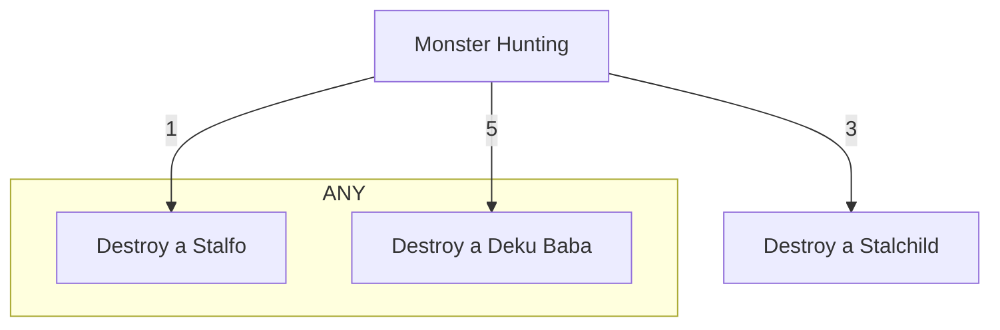

Consider the following quest:

In Hyrule, destroy
- 3 Stalchildren
- 1 Stalfo OR 5 Deku Babas

First create the quest for each task:

**Note: json() is used for brevity**

```cairo
// Note that we do not include completion 
// criteria for these tasks
quest_progress.emit(
  id=1,
  player=0,
  metadataURI_len=4,
  metadataURI=json('{
    "title": "Destroy a Stalchild",
    "description": "They come out at night in Hyrule Field"
  }'),
);
quest_progress.emit(
  id=2,
  player=0,
  metadataURI_len=4,
  metadataURI=json('{
    "title": "Destroy a Stalfo",
    "description": "They come out at night in Hyrule Field"
  }'),
);
quest_progress.emit(
  id=3,
  player=0,
  metadataURI_len=4,
  metadataURI=json('{
    "title": "Destroy a Deku Baba",
    "description": "They can be found throughout Hyrule"
  }'),
);
```

Now we can use those quests as completion criteria:

```cairo
quest_progress.emit(
  id=4,
  player=0,
  metadataURI_len=7,
  metadataURI=json('{
    "title": "Monster Hunting",
    "description": "
      - Destroy 3 Stalchildren 
      - Destroy 1 Stalfo OR 5 Deku Babas
    ",
    "completion": {
      "all": [
        {
          "id": 1,
          "count": 3
        }
      ],
      "any": [
        {
          "id": 2,
          "count": 1
        },
        {
          "id": 3,
          "count": 5
        }
      ]
    }
  }')
);
```

Now we have a small progress tree defined for this quest. It can easily be extended by including completion criteria that in turn has its own completion criteria.




Before the parent quest can be completed, the player (0x123) should perform actions that will result in the following events emitted:

```cairo
// Stalchildren
quest_progress(id=1, player=0x123, ...)
quest_progress(id=1, player=0x123, ...)
quest_progress(id=1, player=0x123, ...)

// Stalfos
quest_progress(id=2, player=0x123, ...)
quest_progress(id=2, player=0x123, ...)

// OR Deku Babas
quest_progress(id=3, player=0x123, ...)
quest_progress(id=3, player=0x123, ...)
quest_progress(id=3, player=0x123, ...)
quest_progress(id=3, player=0x123, ...)
quest_progress(id=3, player=0x123, ...)
```

At this point we can emit the event with the parent quest and it will be considered completed:

```cairo
quest_progress(id=4, player=0x123, ...)
```
